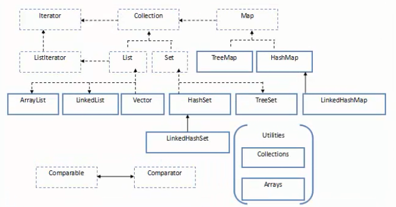

[TOC]

#### 8. 集合

##### 8.1. 集合框架概述

- <font face="楷体" size=4>集合框架的作用：在实际的开发过程中，我们经常会对一组相同类型的数据进行统一管理操作，到目前为止，我们可以使用数组结构、链表结构、二叉树结构来实现。数组最大的问题在于数组中的元素个数是固定的，要实现动态数组，毕竟还是比较麻烦；自己实现链表或二叉树结构来管理对象更是不方便。所以在</font><font face="Arial" size=3>JDK1.2</font><font face="楷体" size=4>版本后，</font><font face="Arial" size=3>Java</font><font face="楷体" size=4>完整的提供了类集合的概念，封装了一组强大的、非常方便的集合框架</font><font face="Arial" size=3>API</font><font face="楷体" size=4>，让我们在开发中大大的提高了效率</font>

- <font face="楷体" size=4>集合中分为三大接口：</font><font face="Arial" size=3>Collection、Map、Iterator</font>

- <font face="楷体" size=4>集合框架的接口和类在</font><font face="Arial" size=3>java.util</font><font face="楷体" size=4>包中</font>

- <font face="楷体" size=4>集合框架结构图：</font>

  

- <font face="Arial" size=3>Collection</font><font face="楷体" size=4>接口</font>

  - <font face="Arial" size=3>Collection</font><font face="楷体" size=4>层次结构中的根接口。</font><font face="Arial" size=3>Collection</font><font face="楷体" size=4>表示一组对象，这些对象也称为</font><font face="Arial" size=3>collection</font><font face="楷体" size=4>的元素。一些</font><font face="Arial" size=3>collection</font><font face="楷体" size=4>允许有重复的元素，而另一些则不允许。一些</font><font face="Arial" size=3>collection</font><font face="楷体" size=4>是有序的，而另一些则是无序的。</font><font face="Arial" size=3>JDK</font><font face="楷体" size=4>不提供此接口的任何直接实现：它提供更具体的子接口（如</font><font face="Arial" size=3>Set</font><font face="楷体" size=4>和</font><font face="Arial" size=3>List</font><font face="楷体" size=4>）实现。此接口通常用来传递</font><font face="Arial" size=3>collection</font><font face="楷体" size=4>，并在需要最大普遍性的地方操作这些</font><font face="Arial" size=3>collection</font>

  - <font face="楷体" size=4>接口的定义：</font>

    ```java
    public interface Collection<E> extends Iterable<E>
    ```

  - <font face="Arial" size=3>List</font><font face="楷体" size=4>接口：</font>

    - <font face="楷体" size=4>有序的，可以重复的</font>
    - <font face="楷体" size=4>允许多个</font><font face="Arial" size=3>null</font><font face="楷体" size=4>元素</font>
    - <font face="楷体" size=4>具体的实现类：</font><font face="Arial" size=3>ArrayList、Vector</font><font face="楷体" size=4>和</font><font face="Arial" size=3>LinkedLIst</font>

  - <font face="Arial" size=3>Set</font><font face="楷体" size=4>接口：</font>

    - <font face="楷体" size=4>无序的（不保证顺序），不允许重复</font>
    - <font face="楷体" size=4>只允许存在一个</font><font face="Arial" size=3>null</font><font face="楷体" size=4>元素</font>
    - <font face="楷体" size=4>具体的实现类：</font><font face="Arial" size=3>HashSet、TreeSet</font><font face="楷体" size=4>和</font><font face="Arial" size=3>LinkedHashSet</font>

- <font face="Arial" size=3>Map</font><font face="楷体" size=4>接口</font>

  - <font face="楷体" size=4>接口的定义：</font>

    ```java
    public interface Map<K, V>
    ```

  - <font face="楷体" size=4>具体的实现类：</font><font face="Arial" size=3>HashMap、TreeMap、LinkedHashMap</font><font face="楷体" size=4>和</font><font face="Arial" size=3>Hashtable</font>

##### 8.2. 集合框架List接口

```java
public interface List<E> extends Collection<E>
// 有序的 collection（也称为序列）。此接口的用户可以对列表中每个元素的插入位置进行精确地控制。用户可以根据元素的整数索引（在列表中的位置）访问元素，并搜索列表中的元素
```

- <font face="Arial" size=3>ArrayList</font>

  ```java
  public class ArrayList<E> extends AbstractList<E> implements List<E>, RandomAccess, Cloneable, Serializable
  ```

  - <font face="Arial" size=3>List</font><font face="楷体" size=4>接口的大小是可变数组的实现。实现了所有可选列表操作，并允许包括</font><font face="Arial" size=3>null</font><font face="楷体" size=4>在内的所有元素。除了实现</font><font face="Arial" size=3>List</font><font face="楷体" size=4>接口外，此类还提供了一些方法来操作内部用来存储列表的数组的大小</font>

  - <font face="楷体" size=4>示例：</font>

    ```java
    import java.util.ArrayList;
    import java.util.List;
    
    /**
     * @author xiao儿
     * @date 2019/9/1 14:09
     * @Description ListDemo
     * <p>
     * Collection 接口：用于存储单个对象的集合
     * List接口：
     * 1.有序的
     * 2.允许多个null元素
     * 3.具体的实现类：ArrayList、Vector、LinkedList
     */
    public class ArrayListDemo {
        public static void main(String[] args) {
            arrayList();
        }
    
        /**
         * ArrayList
         * 1.实现原理：采用动态对象数组实现，默认的构造方法创建了一个空数组
         * 2.第一次添加元素，扩充容量为10，之后的扩充算法：原来数组大小 + 原来数组大小的一半
         * 3.不适合进行删除或者插入操作
         * 4.为了防止数组动态的扩充次数过多，建议创建 ArrayList 时，给定初始容量
         * 5.线程不安全，适合在单线程访问时使用
         * JDK1.2开始
         */
        private static void arrayList() {
            // 使用集合来存储多个不同类型的元素（对象），那么在处理时会比较麻烦，在实际开发中，不建议这样使用
            // 在一个集合中存储相同的类型的对象
            List<String> list = new ArrayList<>();
            list.add("旺仔");
            list.add("真果粒");
            list.add("蒙牛");
            list.add("银桥");
            // list.add(10);
    
            // 遍历集合
            int size = list.size();
            for (int i = 0; i < size; i++) {
                System.out.println(list.get(i));
            }
    
            System.out.println("旺仔是否存在于list中：" + list.contains("旺仔"));
            list.remove("银桥");
            System.out.println("list_size：" + list.size());
    
            String[] array = list.toArray(new String[]{});
            for (String str : array) {
                System.out.println(str);
            }
        }
    }
    ```

- <font face="Arial" size=3>Vector</font>

  - <font face="楷体" size=4>示例：</font>

    ```java
    import java.util.Vector;
    
    /**
     * @author xiao儿
     * @date 2019/9/1 16:46
     * @Description VectorDemo
     */
    public class VectorDemo {
        public static void main(String[] args) {
            vector();
        }
    
        /**
         * Vector
         * 1.实现原理：采用动态对象数组实现，默认构造方法创建了一个大小为10的对象数组
         * 2.扩充的算法：当增量为0时，扩充为原来大小的两倍，当增量大于0时，扩充为原来大小+增量
         * 3.不适合删除或插入操作
         * 4.为了防止数组动态扩充次数过多，建议创建 Vector 时给定初始容量
         * 5.线程安全，适合在多线程访问时使用，在单线程下使用效率较低
         */
        private static void vector() {
            Vector<String> vector = new Vector<>();
            vector.add("旺仔");
            vector.add("真果粒");
            vector.add("蒙牛");
            vector.add("银桥");
    
            int size = vector.size();
            for (int i = 0; i < size; i++) {
                System.out.println(vector.get(i));
            }
        }
    }
    ```

- <font face="Arial" size=3>LinkedList</font>

  ```java
  public class LindedList<E> extends AbstractSequentialList<E> implements List<E>, Deque<E>, Cloneable, Serializable
  ```

  - <font face="Arial" size=3>List</font><font face="楷体" size=4>接口是链表列表实现。实现所有可选的列表的操作，并且允许所有元素（包括</font><font face="Arial" size=3>null</font><font face="楷体" size=4>）。除了实现</font><font face="Arial" size=3>List</font><font face="楷体" size=4>接口外，</font><font face="Arial" size=3>LinkedList</font><font face="楷体" size=4>类还为在列表的开头及结尾</font><font face="Arial" size=3>get、remove</font><font face="楷体" size=4>和</font><font face="Arial" size=3>insert</font><font face="楷体" size=4>元素提供了统一的命名方法</font>

  - <font face="楷体" size=4>示例：</font>

    ```java
    import java.util.LinkedList;
    
    /**
     * @author xiao儿
     * @date 2019/9/1 17:16
     * @Description LinkedListDemo
     */
    public class LinkedListDemo {
        public static void main(String[] args) {
            linkedList();
        }
    
        /**
         * LinkedList
         * 1.实现原理：采用双向链表结构实现
         * 2.适合插入或删除操作，性能高
         * 3.线程不安全
         */
        private static void linkedList() {
            LinkedList<String> linkedList = new LinkedList<>();
            linkedList.add("旺仔");
            linkedList.add("真果粒");
            linkedList.add("蒙牛");
            linkedList.add("银桥");
    
            int size = linkedList.size();
            for (int i = 0; i < size; i++) {
                System.out.println(linkedList.get(i));
            }
        }
    }
    ```

- <font face="楷体" size=4>如何选择</font><font face="Arial" size=3>ArrayList、Vector</font><font face="楷体" size=4>和</font><font face="Arial" size=3>LinkedList</font><font face="楷体" size=4>？</font>

  - <font face="楷体" size=4>安全性问题：</font><font face="Arial" size=3>Vector</font><font face="楷体" size=4>线程安全，但在使用中会使用工具类使得</font><font face="Arial" size=3>ArrayList</font><font face="楷体" size=4>线程安全</font>
  - <font face="楷体" size=4>是否频繁插入或删除操作：</font><font face="Arial" size=3>LinkedList</font>
  - <font face="楷体" size=4>是否是存储后遍历：</font><font face="Arial" size=3>ArrayList</font>

##### 8.3. 集合框架Set接口

```java
public interface Set<E> extends Collection<E>
// 一个不包含重复元素的collection。更确切的说，set不包含满足e1.equals(e2)的元素对e1和e2，并且最多包含一个null元素。正如其名成所暗示的，此接口模仿了数学上的set抽象
```

- <font face="Arial" size=3>HashSet</font>

  ```java
  public class HashSet<E> extends AbstractSet<E> implements Set<E>, Cloneable, Serializable
  ```

  - <font face="楷体" size=4>类实现</font><font face="Arial" size=3>Set</font><font face="楷体" size=4>接口，有哈希表（实际上是一个</font><font face="Arial" size=3>HashMap</font><font face="楷体" size=4>实例）支持。它不保证</font><font face="Arial" size=3>set</font><font face="楷体" size=4>的迭代顺序；特别是它不保证该顺序恒久不变。此类允许使用</font><font face="Arial" size=3>null</font><font face="楷体" size=4>元素</font>

  - <font face="楷体" size=4>示例：</font>

    ```java
    // Cat
    /**
     * @author xiao儿
     * @date 2019/9/1 18:33
     * @Description Cat
     */
    public class Cat {
        private String name;
        private int age;
        private int id;
    
        public Cat() {
        }
    
        public Cat(String name, int age, int id) {
            this.name = name;
            this.age = age;
            this.id = id;
        }
    
        public String getName() {
            return name;
        }
    
        public void setName(String name) {
            this.name = name;
        }
    
        public int getAge() {
            return age;
        }
    
        public void setAge(int age) {
            this.age = age;
        }
    
        public int getId() {
            return id;
        }
    
        public void setId(int id) {
            this.id = id;
        }
    
        @Override
        public String toString() {
            return "Cat{" +
                    "name='" + name + '\'' +
                    ", age=" + age +
                    ", id=" + id +
                    '}';
        }
    
        @Override
        public boolean equals(Object o) {
            if (this == o) return true;
            if (!(o instanceof Cat)) return false;
    
            Cat cat = (Cat) o;
    
            if (age != cat.age) return false;
            if (id != cat.id) return false;
            return name != null ? name.equals(cat.name) : cat.name == null;
        }
    
        @Override
        public int hashCode() {
            int result = name != null ? name.hashCode() : 0;
            result = 31 * result + age;
            result = 31 * result + id;
            return result;
        }
    }
    
    // HashSetDemo
    import java.util.Arrays;
    import java.util.HashSet;
    import java.util.Set;
    
    /**
     * @author xiao儿
     * @date 2019/9/1 18:03
     * @Description HashSetDemo
     * 
     * Set 接口：
     * 1.无序的（不保证顺序）
     * 2.不允许重复元素
     * 3.可以存在一个null元素
     * 4.具体实现类：HashSet、TreeSet 和 LinkedHashSet
     */
    public class HashSetDemo {
        public static void main(String[] args) {
            hashSet();
        }
    
        /**
         * HashSet
         * 1.实现原理：基于哈希表（HashMap）实现
         * 2.不允许重复元素，可以有一个null元素
         * 3.不保证顺序恒久不变
         * 4.添加元素时把元素作为 HashMap 的key存储，HashMap的value使用一个固定的Object对象
         * 5.排除重复元素是通过equals来检查对象是否相同
         * 6.判断两个对象是否相同：先判断两个对象的hashCode是否相同（如果两个对象的hashCode相同，不一定是同一对象，如果不同，
         * 那一定不是同一个对象），如果不同则两个对象不是同一个对象，如果相同，还要进行equals判断，equals相同则是同一个对象，
         * 不同则不是同一个对象
         * 7.自定义对象要认为属性值都相同时为同一个对象，有这种需求时，那么我们需要重写所在类的hashCode和equals方法
         *
         * 小结：
         * （1）哈希表的存储结构：数组+链表（数组里的每一个元素以链表中的形式存储）
         * （2）如果把对象存储到哈希表中，先计算对象的hashCode值，在对数组长度求余数，来决定对象要存储在数组中的那个位置
         * （3）解决hashSet中的重复值使用的方式是：第6点
         */
        private static void hashSet() {
            Set<String> hashSet = new HashSet<>();
            hashSet.add("旺仔");
            hashSet.add("真果粒");
            hashSet.add("蒙牛");
            hashSet.add("银桥");
            hashSet.add("旺仔");
    
            System.out.println(hashSet.size());
    
            String[] strings = hashSet.toArray(new String[]{});
            for (String s : strings) {
                System.out.println(s);
            }
            System.out.println(Arrays.toString(strings));
    
            Cat cat = new Cat("miaomiao", 5, 1);
            Cat cat1 = new Cat("huahua", 2, 3);
            Cat cat2 = new Cat("tom", 4, 2);
            Cat cat3 = new Cat("miaomiao", 5, 4);
            Cat cat4 = new Cat("beibei", 3, 3);
            Set<Cat> catSet = new HashSet<>();
            catSet.add(cat);
            catSet.add(cat1);
            catSet.add(cat2);
            catSet.add(cat3);
            catSet.add(cat4);
            catSet.add(cat);
            System.out.println("catSet的长度：" + catSet.size());
    
            for (Cat c : catSet) {
                System.out.println(c);
            }
            System.out.println("cat的hashCode是：" + cat.hashCode() % 16);
            System.out.println("cat1的hashCode是：" + cat1.hashCode() % 16);
            System.out.println("cat2的hashCode是：" + cat2.hashCode() % 16);
            System.out.println("cat3的hashCode是：" + cat3.hashCode() % 16);
            System.out.println("cat4的hashCode是：" + cat4.hashCode() % 16);
        }
    }
    ```

  - <font face="Arial" size=3>hashCode</font><font face="楷体" size=4>深入分析：</font>

    ```java
    hashCode()方法，在Object类中定义如下：
    public native int hashCode();
    hashCode()是本地方法，它的实现是根据本地机器相关，当然我们可以在自己写的类中覆盖hashCode()方法，比如String、Integer、Double...等等这些类都是覆盖了hashCode()方法的
    ```

  - <font face="楷体" size=4>在</font><font face="Arial" size=3>Java</font><font face="楷体" size=4>的集合中，判断两个对象是否相等的规则是：</font>

    - <font face="楷体" size=4>判断两个对象的</font><font face="Arial" size=3>hashCode</font><font face="楷体" size=4>是否相等</font>
      - <font face="楷体" size=4>如果不相等，认为两个对象也不相等，结束</font>
      - <font face="楷体" size=4>如果相等，则转下一步</font>
    - <font face="楷体" size=4>判断两个对象用</font><font face="Arial" size=3>equals</font><font face="楷体" size=4>运算是否相等</font>
      - <font face="楷体" size=4>如果不相等，认为两个对象也不相等</font>
      - <font face="楷体" size=4>如果相等，认为两个对象相等</font>
      - <font face="楷体" size=4>（</font><font face="Arial" size=3>equals()</font><font face="楷体" size=4>是判断两个对象是否相等的关键）</font>

- <font face="Arial" size=3>TreeSet</font>

  ```java
  public class TreeSet<E> extends AbstractSet<E> implements NavigableSet<E>, Cloneable, Serializable
  ```

  - <font face="楷体" size=4>基于</font><font face="Arial" size=3>TreeMap</font><font face="楷体" size=4>的</font><font face="Arial" size=3>NavigableSet</font><font face="楷体" size=4>实现。使用元素的自然顺序对元素进行排序，或者根据创建</font><font face="Arial" size=3>set</font><font face="楷体" size=4>时提供的</font><font face="Arial" size=3>Comparator</font><font face="楷体" size=4>进行排序，具体取决于使用的构造方法</font>

  - <font face="楷体" size=4>示例：</font>

    ```java
    // CatComparator
    import java.util.Comparator;
    
    /**
     * @author xiao儿
     * @date 2019/9/1 22:05
     * @Description CatComparator
     */
    public class CatComparator implements Comparator<Cat> {
        @Override
        public int compare(Cat o1, Cat o2) {
            return o1.getAge() - o2.getAge();
        }
    }
    
    // TreeSetDemo
    import java.util.TreeSet;
    
    /**
     * @author xiao儿
     * @date 2019/9/1 21:55
     * @Description TreeSetDemo
     */
    public class TreeSetDemo {
        public static void main(String[] args) {
            treeSet();
        }
    
        /**
         * TreeSet
         * 1.有序的，基于 TreeMap（二叉树数据结构），对象需要比较大小，通过对象比较器 Comparator，对象比较器还可以去除重复元素
         * 如果自定义的数据类，没有实现比较器接口，将无法添加到 TreeSet 集合中
         */
        private static void treeSet() {
            TreeSet<Cat> treeSet = new TreeSet<>(new CatComparator());
            Cat cat = new Cat("miaomiao", 5, 1);
            Cat cat1 = new Cat("huahua", 2, 3);
            Cat cat2 = new Cat("tom", 3, 2);
            Cat cat3 = new Cat("miaomiao", 4, 4);
            Cat cat4 = new Cat("beibei", 3, 3);
            treeSet.add(cat);
            treeSet.add(cat1);
            treeSet.add(cat2);
            treeSet.add(cat3);
            treeSet.add(cat4);
    
            System.out.println(treeSet.size());
    
            for (Cat c : treeSet) {
                System.out.println(c);
            }
        }
    }
    ```

- <font face="Arial" size=3>LinkedHashSet</font>

  ```java
  public class LinkedHashSet<E> extends HashSet<E> implements Set<E>, Cloneable, Serializable
  ```

  - <font face="楷体" size=4>具有可预知迭代顺序的</font><font face="Arial" size=3>Set</font><font face="楷体" size=4>接口的哈希表和链表列表实现。此实现与</font><font face="Arial" size=3>HashSet</font><font face="楷体" size=4>的不同之处在于，后者维护着一个运行于所有条目的双重链表列表。此链接列表定义了迭代顺序，即按照将元素插入到</font><font face="Arial" size=3>set</font><font face="楷体" size=4>中的顺序（插入顺序）进行迭代。注意，插入顺序不受在</font><font face="Arial" size=3>set</font><font face="楷体" size=4>中重新插入元素的影响。（如果在</font><font face="Arial" size=3>s.contains(e)</font><font face="楷体" size=4>返回</font><font face="Arial" size=3>true</font><font face="楷体" size=4>后立即调用</font><font face="Arial" size=3>s.add(e)</font><font face="楷体" size=4>，则元素</font><font face="Arial" size=3>e</font><font face="楷体" size=4>会被重新插入到</font><font face="Arial" size=3>set s</font><font face="楷体" size=4>中</font>

  - <font face="楷体" size=4>示例：</font>

    ```java
    import java.util.LinkedHashSet;
    
    /**
     * @author xiao儿
     * @date 2019/9/1 22:23
     * @Description LinkedHashSetDemo
     */
    public class LinkedHashSetDemo {
        public static void main(String[] args) {
            linkedHashSet();
        }
    
        /**
         * LinkedHashSet
         * 1.实现原理：哈希表和链表列表实现
         */
        private static void linkedHashSet() {
            LinkedHashSet<Cat> cats = new LinkedHashSet<>();
            Cat cat = new Cat("miaomiao", 5, 1);
            Cat cat1 = new Cat("huahua", 2, 3);
            Cat cat2 = new Cat("tom", 3, 2);
            Cat cat3 = new Cat("miaomiao", 4, 4);
            Cat cat4 = new Cat("beibei", 3, 3);
            cats.add(cat);
            cats.add(cat1);
            cats.add(cat2);
            cats.add(cat3);
            cats.add(cat4);
    
            for (Cat c : cats) {
                System.out.println(c);
            }
        }
    }<font face="楷体" size=4></font>
    ```

- <font face="楷体" size=4>如何选择</font><font face="Arial" size=3>HashSet、TreeSet</font><font face="楷体" size=4>和</font><font face="Arial" size=3>LinkedHashSet</font><font face="楷体" size=4>？</font>

  - <font face="楷体" size=4>如果不要保证元素有序，使用</font><font face="Arial" size=3>TreeSet</font>
  - <font face="楷体" size=4>如果不需要元素有序而且不需要保证插入顺序，使用</font><font face="Arial" size=3>HashSet</font>
  - <font face="楷体" size=4>如果不需要保证元素有序，但是需要保证插入顺序，使用</font><font face="Arial" size=3>LinkedHashSet</font>

##### 8.4. 集合框架Iterator接口

- <font face="楷体" size=4>集合输出：</font>

  - <font face="Arial" size=3 color=red>Iterator</font><font face="楷体" size=4>（使用率最高）</font>
  - <font face="Arial" size=3>ListIterator</font>
  - <font face="Arial" size=3>Enumeration</font>
  - <font face="Arial" size=3 color=red>foreach</font><font face="楷体" size=4>（1.5之后使用率最高）</font>

- <font face="楷体" size=4>示例：</font>

  ```java
  import java.util.*;
  
  /**
   * @author xiao儿
   * @date 2019/9/1 23:33
   * @Description IteratorDemo
   */
  public class IteratorDemo {
      public static void main(String[] args) {
          List<Cat> list = new ArrayList<>();
          Cat cat = new Cat("miaomiao", 5, 1);
          Cat cat1 = new Cat("huahua", 2, 3);
          Cat cat2 = new Cat("tom", 4, 2);
          Cat cat3 = new Cat("miaomiao", 5, 4);
          Cat cat4 = new Cat("beibei", 3, 3);
          list.add(cat);
          list.add(cat1);
          list.add(cat2);
          list.add(cat3);
          list.add(cat4);
  
          foreach(list);
          System.out.println("-----------------");
          iterator(list);
          System.out.println("-----------------");
          enumeration();
      }
  
      // foreach(1.5)
      private static void foreach(Collection<Cat> cats) {
          for (Cat c : cats) {
              System.out.println(c);
          }
      }
  
      // iterator(1.5之前统一的迭代集合方式）
      private static void iterator(Collection<Cat> cats) {
          Iterator<Cat> iter = cats.iterator();
          while (iter.hasNext()) {
              System.out.println(iter.next());
          }
      }
  
      // enumeartion
      private static void enumeration() {
          Vector<String> vector = new Vector<>();
          vectorlist.forEach((String s) -> {
              System.out.println(s);
          });.add("Tom");
          vector.add("Jack");
          vector.add("Job");
          vector.add("Lily");
  
          Enumeration<String> enumeration = vector.elements();
          while (enumeration.hasMoreElements()) {
              System.out.println(enumeration.nextElement());
          }
      }
  }
  ```
  
- <font face="Arial" size=3>foreach</font>

  - <font face="楷体" size=4>在使用</font><font face="Arial" size=3>foreach</font><font face="楷体" size=4>输出的时候要注意：创建集合时要指定操作泛型的类型</font>

  - <font face="Arial" size=3>JDK1.8</font><font face="楷体" size=4>新特性：</font>

    ```java
    // no.1
    list.forEach((String s) -> {System.out.println(s);});
    // no.2
    list.forEach(s -> {System.out.println(s);});
    // no.3
    list.forEach(s -> System.out.println(s));
    // no.4
    list.forEach(System.out::println);
    // no.5
    list.forEach(new MyConsumer());// 自己写一个类 MyConsumer 实现 Consumer 接口
    ```

##### 8.5. JDK1.8新特性

- <font face="Arial" size=3>Consumer\<T\></font><font face="楷体" size=4>接口：消费者接口</font>

   ```java
   import java.util.function.Consumer;
   
   /**
    * @author xiao儿
    * @date 2019/9/2 8:31
    * @Description ConsumerDemo
    */
   public class ConsumerDemo {
       public static void main(String[] args) {
           consumer();
       }
   
       // 消费者接口
       private static void consumer() {
           strToUpp("xiaoer", str -> System.out.println(str.toUpperCase()));
       }
   
       public static void strToUpp(String str, Consumer<String> consumer) {
           consumer.accept(str);
       }
   }
   ```

- <font face="Arial" size=3>Function\<T,R\></font><font face="楷体" size=4>接口：表示接受一个参数并产生结果的函数</font>

   ```java
   import java.util.function.Function;
   
   /**
    * @author xiao儿
    * @date 2019/9/2 8:21
    * @Description FunctionDemo
    */
   public class FunctionDemo {
       public static void main(String[] args) {
           function();
       }
   
       // 表示接受一个参数并产生结果的函数
       private static void function() {
           String s = strToUpp("xiaoer", str -> str.toUpperCase());
           System.out.println(s);
       }
   
       public static String strToUpp(String str, Function<String, String> f) {
           return f.apply(str);
       }
   }
   ```

- <font face="Arial" size=3>Supplier\<T\></font><font face="楷体" size=4>接口：代表结果供应商</font>

   ```java
   import java.util.ArrayList;
   import java.util.List;
   import java.util.function.Supplier;
   
   /**
    * @author xiao儿
    * @date 2019/9/2 8:40
    * @Description SupplierDemo
    */
   public class SupplierDemo {
       public static void main(String[] args) {
           supplier();
       }
   
       // 代表结果供应商
       private static void supplier() {
           List<Integer> list = getNums(10, () -> (int) (Math.random() * 100));
           list.forEach((i) -> {
               System.out.println(i);
           });
           System.out.println("------------");
           list.forEach(System.out::println);
       }
   
       public static List<Integer> getNums(int num, Supplier<Integer> supplier) {
           List<Integer> list = new ArrayList<>();
           for (int i = 0; i < num; i++) {
               list.add(supplier.get());
           }
           return list;
       }
   }
   ```

- <font face="Arial" size=3>Predicate\<T\></font><font face="楷体" size=4>接口：断言接口</font>

   ```java
   import java.util.ArrayList;
   import java.util.Arrays;
   import java.util.List;
   import java.util.function.Predicate;
   
   /**
    * @author xiao儿
    * @date 2019/9/2 8:50
    * @Description PredicateDemo
    */
   public class PredicateDemo {
       public static void main(String[] args) {
           predicate();
       }
   
       // 断言接口
       private static void predicate() {
           List<String> list = Arrays.asList("Lily", "Tom", "Job", "Curly");
           List<String> result = filter(list, s -> s.contains("C"));
           result.forEach(System.out::println);
       }
   
       private static List<String> filter(List<String> list, Predicate<String> predicate) {
           List<String> result = new ArrayList<>();
           for (String s : list) {
               if (predicate.test(s)) {// 测试是否符合要求
                   result.add(s);
               }
           }
           return result;
       }
   }
   ```

##### 8.6. JDK1.8新特性之Stream

- <font face="楷体" size=4>什么是</font><font face="Arial" size=3>Stream</font><font face="楷体" size=4>？</font>

  - <font face="Arial" size=3>Stream</font><font face="楷体" size=4>是元素的集合，这点让</font><font face="Arial" size=3>Stream</font><font face="楷体" size=4>看起来有些类似</font><font face="Arial" size=3>Iterator</font>
  - <font face="楷体" size=4>可以支持顺序和并行的对原</font><font face="Arial" size=3>Stream</font><font face="楷体" size=4>进行汇聚的操作</font>

- <font face="楷体" size=4>我们可以把</font><font face="Arial" size=3>Stream</font><font face="楷体" size=4>当成一个高级版本的</font><font face="Arial" size=3>Iterator</font><font face="楷体" size=4>。原始版本的</font><font face="Arial" size=3>Iterator</font><font face="楷体" size=4>，用户只能一个一个的遍历元素并对其进行某些操作；高级版本的</font><font face="Arial" size=3>Stream</font><font face="楷体" size=4>，用户只需要对其包含的元素执行什么操作，比如“过滤掉长度大于10的字符串”、“获取每个字符串的首字母”等，具体这些操作如何应用到每个元素上，就给</font><font face="Arial" size=3>Stream</font><font face="楷体" size=4>就好了</font>

- <font face="楷体" size=4>示例：</font>

  ```java
  import java.util.Arrays;
  import java.util.List;
  import java.util.Optional;
  import java.util.function.BinaryOperator;
  import java.util.stream.Collectors;
  import java.util.stream.Stream;
  
  /**
   * @author xiao儿
   * @date 2019/9/2 9:14
   * @Description StreamDemo
   * <p>
   * Stream接口：不是存储的数据结构，数据源可以是一个集合，为了函数式编程创造
   * 惰式执行，数据只能被消费一次
   * <p>
   * 两种类型的操作方法：
   * 1.中间操作（生成一个 Stream）
   * 2.结束操作（执行计算操作）
   */
  public class StreamDemo {
      public static void main(String[] args) {
          // foreach方法
          Stream<String> stream = Stream.of("good", "good", "study", "day", "day", "up");
          // stream.forEach((str) -> {
          //     System.out.println(str);
          // });
          // System.out.println("------------");
  
          // filter
          // stream.filter((s) -> s.length() > 3).forEach(System.out::println);
          // System.out.println("----------------");
  
          // distinct
          // stream.distinct().forEach(s -> System.out.println(s));
  
          // map
          // stream.map(s -> s.toUpperCase()).forEach(s -> System.out.println(s));
  
          // flatMap
          // Stream<List<Integer>> num = Stream.of(Arrays.asList(1, 2, 3), Arrays.asList(4, 5));
          // num.flatMap(list -> list.stream()).forEach(s -> System.out.println(s));
  
          // reduce
          // Optional<String> optionalS = stream.reduce((s1, s2) -> s1.length() >= s2.length() ? s1 : s2);
          // System.out.println(optionalS.get());
  
          // collect
          List<String> list = stream.collect(Collectors.toList());
          list.forEach(s -> System.out.println(s));
  
          // :: 方法的引用
          // 引用静态的方法 Integer::valueOf
          // 引用对象的方法 list::add
          // 引用构造方法 Arrayalist::new
      }
  }
  ```

##### 8.7. 集合框架Map接口

```java
public interface Map<K, V>
// 将键映射到值得对象，一个映射不能包含重复的键；每个键最多只能映射到一个值
```

- <font face="Arial" size=3>HashMap</font>

  ```java
  public class HashMap<K, V> extends AbstractMap<K,V> implements Map<K, V>, Cloneable, Serializable
  ```

  - <font face="楷体" size=4>基于哈希表的</font><font face="Arial" size=3>Map</font><font face="楷体" size=4>接口的实现。此实现提供所有可选的映射操作，并允许使用</font><font face="Arial" size=3>null</font><font face="楷体" size=4>值和</font><font face="Arial" size=3>null</font><font face="楷体" size=4>键。（除了非同步和允许使用</font><font face="Arial" size=3>null</font><font face="楷体" size=4>之外，</font><font face="Arial" size=3>HashMap</font><font face="楷体" size=4>类与</font><font face="Arial" size=3>Hashtable</font><font face="楷体" size=4>大致相同。）此类不保证映射的顺序，特别是它不保证该顺序恒久不变</font>

  - <font face="楷体" size=4>示例：</font>

    ```java
    import java.util.Collection;
    import java.util.HashMap;
    import java.util.Map;
    import java.util.Set;
    import java.util.stream.Stream;
    
    /**
     * @author xiao儿
     * @date 2019/9/2 10:00
     * @Description HashMapDemo
     *
     * Map接口：
     * 1.键值对存储一组对象
     * 2.Key保证唯一，不能重复；Value可以重复
     * 3.具体的实现类：HashMap、TreeMap 和 Hashtable LinkedHashMap
     */
    public class HashMapDemo {
        public static void main(String[] args) {
            hashMap();
        }
    
        /**
         * HashMap 的实现原理：
         * 1.基于哈希表（数组+链表+二叉树（红黑树））
         * 2.默认负载因子：0.75，默认数组大小是16
         * 3.把对象存储到哈希表中，如何存储？
         * 把key对象通过hash方法计算哈希值，然后用哈希值对数组长度取余（默认是16），来决定该key对象在数组中存储的位置，
         * 当这个位置有多个对象时，以链表存储，JDK1.8后，当链表长度大于8时，链表将转换为二叉树（红黑树）
         * 这样的目的：为了取值更快，存储的数据量越大，性能的表现越明显
         * 4.扩充原理：当数组的容量超过了75%，那么表示该数组需要扩充，如何扩充？
         * 扩充的算法：当前的数组容量<<1（相当于是乘以2），扩大1倍，扩充次数过多会影响性能，每次扩充表示哈希表重新散列
         * （重新计算每个对象的存储位置），我们在开发中尽量要减少扩充次数带来的性能问题
         * 5.线程不安全，适合在单线程中使用
         */
        private static void hashMap() {
            Map<Integer, String> map = new HashMap<>();
            map.put(1, "Tom");
            map.put(2, "Jack");
            map.put(3, "Lily");
            map.put(4, "Bin");
    
            System.out.println("size=" + map.size());
            // 从map中取值
            System.out.println(map.get(1));
            System.out.println("------------");
    
            // map的遍历
            Set<Map.Entry<Integer, String>> entrySet = map.entrySet();
            for (Map.Entry e : entrySet) {
                System.out.println(e.getKey() + "->" + e.getValue());
            }
            System.out.println("------------");
    
            // keySet：遍历键，可以通过键查找值
            Set<Integer> keys = map.keySet();
            for (Integer i : keys) {
                String value = map.get(i);
                System.out.println(i + "->" + value);
            }
            System.out.println("------------");
    
            // values：遍历值，不能通过值查找键
            Collection<String> values =  map.values();
            for (String s : values) {
                System.out.println(s);
            }
            System.out.println("------------");
    
            // foreach
            map.forEach((key, value) -> System.out.println(key + "->" + value));
    
            System.out.println(map.containsKey(7));
            System.out.println("------------");
    
            // hash
            Integer key = 1314;
            int h;
            int hashCode = (key.hashCode());
            int hash = (h = key.hashCode()) ^ (h >>> 16);
            int count = hash & 15;
            System.out.println(hashCode);
            System.out.println(hash);
            System.out.println(count);
        }
    }
    ```

- <font face="Arial" size=3>TreeMap</font>

  ```java
  public class TreeMap<K, V> extends AbstractMap<K, V> implements NavigableMap<K, V>, Cloneable, Serializable
  ```

  - <font face="楷体" size=4>基于红黑树（</font><font face="Arial" size=3>Red-Black tree</font><font face="楷体" size=4>）的</font><font face="Arial" size=3>NavigableMap</font><font face="楷体" size=4>实现。该映射根据其键的自然顺序进行排序，或者根据创建映射时提供的</font><font face="Arial" size=3>Comparator</font><font face="楷体" size=4>进行排序，具体取决于使用的构造方法</font>

  - <font face="楷体" size=4>示例：</font>

    ```java
    // Dog
    /**
     * @author xiao儿
     * @date 2019/9/2 18:13
     * @Description Dog
     */
    public class Dog {
        private int id;
        private String name;
        private int age;
    
        public Dog() {
        }
    
        public Dog(int id, String name, int age) {
            this.id = id;
            this.name = name;
            this.age = age;
        }
    
        public int getId() {
            return id;
        }
    
        public void setId(int id) {
            this.id = id;
        }
    
        public String getName() {
            return name;
        }
    
        public void setName(String name) {
            this.name = name;
        }
    
        public int getAge() {
            return age;
        }
    
        public void setAge(int age) {
            this.age = age;
        }
    
        @Override
        public String toString() {
            return "Dog{" +
                    "id=" + id +
                    ", name='" + name + '\'' +
                    ", age=" + age +
                    '}';
        }
    }
    
    // DogComparator
    import java.util.Comparator;
    
    /**
     * @author xiao儿
     * @date 2019/9/2 18:17
     * @Description DogComparator
     */
    public class DogComparator implements Comparator<Dog> {
    
        @Override
        public int compare(Dog o1, Dog o2) {
            return o1.getId() - o2.getId();
        }
    }
    
    // TreeMapDemo
    import java.util.Map;
    import java.util.TreeMap;
    
    /**
     * @author xiao儿
     * @date 2019/9/2 18:09
     * @Description TreeMapDemo
     */
    public class TreeMapDemo {
        public static void main(String[] args) {
            treeMap();
        }
    
        /**
         * TreeMap
         * 1.基于二叉树的红黑树实现
         */
        private static void treeMap() {
            Map<String, String> map = new TreeMap<>();
            map.put("one", "Lily");
            map.put("two", "Tom");
            map.put("three", "Bin");
    
            map.forEach((key, value) -> System.out.println(key + "->" + value));
            System.out.println("---------------");
    
            Map<Dog, String> dogs = new TreeMap<>(new DogComparator());
            dogs.put(new Dog(1, "二哈", 3), "dog1");
            dogs.put(new Dog(2, "三哈", 2), "dog2");
            dogs.put(new Dog(3, "四哈", 4), "dog3");
    
            dogs.forEach((dog, value) -> System.out.println(dog + "->" + value));
        }
    }
    ```

- <font face="Arial" size=3>Hashtable</font>

  ```java
  public class Hashtable<K, V> extends Dictionary<K, V> implements Map<K, V>, Cloneable, Serializable
  ```

  - <font face="楷体" size=4>此类实现一个哈希表，该哈希表将键映射到相应的值。任何非</font><font face="Arial" size=3>null</font><font face="楷体" size=4>对象都可以用作键或值。为了成功地在哈希表中存储和获取对象，用作键的对象必须实现</font><font face="Arial" size=3>hashCode</font><font face="楷体" size=4>方法和</font><font face="Arial" size=3>equals</font><font face="楷体" size=4>方法</font>

  - <font face="楷体" size=4>示例：</font>

    ```java
    import java.util.Hashtable;
    import java.util.Map;
    
    /**
     * @author xiao儿
     * @date 2019/9/2 17:34
     * @Description Hashtable
     */
    public class HashtableDemo {
        public static void main(String[] args) {
            hashtable();
        }
    
        /**
         * Hashtable
         * 1.JDK1.0开始
         * 2.基于哈希表实现（数组+链表）
         * 3.默认数组大小是11，加载因子0.75
         * 4.扩充方式：原数组大小<<1（*2） + 1
         * 5.线程安全的，用在多线程访问时
         */
        private static void hashtable() {
            Map<String, String> hashtable = new Hashtable<>();
            hashtable.put("one", "Lily");
            hashtable.put("two", "Tom");
            hashtable.put("three", "Bin");
    
            hashtable.forEach((key, value) -> System.out.println(key + "->" + value));
        }
    }
    ```

- <font face="Arial" size=3>LinkedHashMap</font>

  ```java
  public class LinkedHashMap<K, V> extends HashMap<K, V> implements Map<K, V>
  ```

  - <font face="Arial" size=3>Map</font><font face="楷体" size=4>接口的哈希表和链接列表实现，具有可预知的迭代顺序。此实现与</font><font face="Arial" size=3>HashMap</font><font face="楷体" size=4>的不同之处在于，后者维护着一个运行于所有条目的双重链接列表</font>

  - <font face="楷体" size=4>示例：</font>

    ```java
    import java.util.LinkedHashMap;
    import java.util.Map;
    
    /**
     * @author xiao儿
     * @date 2019/9/2 17:59
     * @Description LinkedHashMapDemo
     */
    public class LinkedHashMapDemo {
        public static void main(String[] args) {
            linkedHashMap();
        }
    
        /**
         * LinkedHashMap
         * 1.LinkedHashMap 是 HashMap 的子类，由于 HashMap 不能保证顺序恒久不变，此类使用双重链表来维护元素添加的顺序
         */
        private static void linkedHashMap() {
            Map<String, String> map = new LinkedHashMap<>();
            map.put("one", "Lily");
            map.put("two", "Tom");
            map.put("three", "Bin");
    
            map.forEach((key, value) -> {
                System.out.println(key + "->" + value);
            });
        }
    }
    ```

- <font face="Arial" size=3>JDK1.8Map</font><font face="楷体" size=4>新特性</font>

  - <font face="Arial" size=3>Map</font><font face="楷体" size=4>接口中的新方法：在</font><font face="Arial" size=3>JDK1.8</font><font face="楷体" size=4>中新增了许多</font><font face="Arial" size=3>default</font><font face="楷体" size=4>方法</font>

  - <font face="楷体" size=4>示例：</font>

    ```java
    import java.util.HashMap;
    import java.util.Map;
    
    /**
     * @author xiao儿
     * @date 2019/9/2 18:38
     * @Description MapNewMethodDemo
     */
    public class MapNewMethodDemo {
        public static void main(String[] args) {
            Map<Integer, String> map = new HashMap<>();
            map.put(1, "Jack");
            map.put(2, "Tom");
            map.put(3, "Lily");
    
            String str = map.getOrDefault(4, "null");
            System.out.println(str);
            System.out.println("---------------");
    
            // String val = map.put(3, "Vince");
            // 只会添加不存在相同key的值
            String val = map.putIfAbsent(3, "Vince");
            System.out.println(val);
            map.forEach((key, value) -> System.out.println(key + "->" + value));
            System.out.println("---------------");
    
            // 根据键和值都匹配时才会删除
            boolean b = map.remove(1, "Lily");
            System.out.println("是否删除：" + b);
            System.out.println("----------------");
    
            // 替换
            String string  = map.replace(3, "Vince");
            System.out.println(string);
            map.forEach((key, value) -> System.out.println(key + "->" + value));
            System.out.println("-----------------");
    
            // 替换
            boolean b1 = map.replace(3, "Vince", "Lily");
            System.out.println("是否替换成功：" + b1);
            System.out.println("------------------");
    
            String string1 = map.compute(1, (key, value) -> value + "1");
            System.out.println(string1);
            System.out.println("-------------------");
    
            String string2 = map.computeIfAbsent(4, value -> value + "test");
            System.out.println(string2);
            System.out.println("-------------------");
    
            String string3 = map.merge(1, "888", (oldValue, newValue) -> oldValue.concat(newValue));
            System.out.println(string3);
        }
    }
    ```

##### 8.8. Collections工具类

- <font face="楷体" size=4>排序操作（主要针对</font><font face="Arial" size=3>List</font><font face="楷体" size=4>接口相关）</font>

  ```java
  // 反转指定List集合中元素的顺序
  reverse(List list);
  // 对List中的元素进行随机排序（洗牌）
  shuffle(List list);
  // 对List里的元素根据自然升序排序
  sort(List list);
  // 自定义比较器进行排序
  sort(List list, Comparator c);
  // 将指定List集合中i处的元素和j处元素进行交换
  swap(List list, int i, int j);
  // 将所有元素向右移位指定长度，如果distance等于size那么结果不变
  rotate(List list, int distance);
  ```

- <font face="楷体" size=4>查找和替换（主要针对</font><font face="Arial" size=3>Collection</font><font face="楷体" size=4>接口相关）</font>

  ```java
  // 使用二分搜索法，以获得指定对象在List中的索引，前提是集合已经排序
  binarySearch(List list, Object key);
  // 返回最大元素
  max(Collection coll);
  // 根据自定义比较器，返回最大元素
  max(Collection coll, Comparator comp);
  // 返回最小元素
  min(Collection coll);
  // 根据自定义比较器，返回最小元素
  min(Collection coll, Comparator comp);
  // 使用指定对象填充
  fill(List list, Object obj);
  // 返回指定集合中指定对象出现的次数
  frequency(Collection Object o);
  // 替换
  replaceAll(List list, Object old, Object new);
  ```

- <font face="楷体" size=4>同步控制</font>

  - <font face="Arial" size=3>Collections</font><font face="楷体" size=4>工具类中提供了多个</font><font face="Arial" size=3>synchronizedXxx</font><font face="楷体" size=4>方法，该方法返回指定集合对象对应的同步对象，从而解决多线程并发访问集合时线程的安全问题。</font><font face="Arial" size=3>HashSet、ArrayList、HashMap</font><font face="楷体" size=4>都是线程不安全的，如果需要考虑同步，则使用这些方法。这些方法主要有：</font><font face="Arial" size=3>synchronizedSet、synchronizedSortedSet、synchronizedList、synchronizedMap、synchronizedSortedMap</font>
  - <font face="楷体" size=4 color=red>注意：在使用迭代方法遍历集合对象时需要手工同步返回的集合</font>

- <font face="楷体" size=4>设置不可变集合：</font><font face="Arial" size=3>Collections</font><font face="楷体" size=4>有三类方法可返回一个不可变集合</font>

  ```java
  // 返回一个空的不可变的集合对象
  emptyXxx();
  // 返回一个只包含指定对象的，不可变的集合对象
  singletonXxx();
  // 返回指定集合对象的不可变视图
  unmodifiableXxx();
  ```

- <font face="楷体" size=4>其他</font>

  ```java
  // 如果两个指定collection中没有相同的元素，则返回true
  disjoint(Collection<?> c1, Collection<?> c2);
  // 一种方便的方式，将所有指定元素添加到指定collection中
  addAll(Collection<? super T> c, T...a);
  // 返回一个比较器，它强行反转指定比较器的顺序。如果指定比较器为null，则此方法等同于reverseOrder()（换句话说，它返回一个比较器，该比较器将强行反转实现Comparable接口那些对象collection上的自然顺序）
  Comparator<T> reverseOrder(Comparator<T> cmp);
  ```

##### 8.9. Optional容器类

- <font face="楷体" size=4>这是一个可以为</font><font face="Arial" size=3>null</font><font face="楷体" size=4>的容器对象。如果值存在则</font><font face="Arial" size=3>isPresent()</font><font face="楷体" size=4>方法会返回</font><font face="Arial" size=3>true</font><font face="楷体" size=4>，调用</font><font face="Arial" size=3>get()</font><font face="楷体" size=4>方法会返回该对象</font>

  ```java
  // 为非null的值创建一个Optional
  of
  // 为指定的值创建一个Optional，如果指定的值为null，则返回一个空的Optional
  ofNUllable
  // 如果值存在返回true，否则返回false
  isPresent
  // 如果Optional有值则将其返回，否则抛出NoSuchElementException
  get
  // 如果Optional实例有值则为其调用consumer，否则不做处理
  ifPresent
  // 如果有值则将其返回，否则返回指定的其他值
  orElse
  // orElseGet与orElse方法类似，区别在于得到的默认值。orElse方法将传入的字符串作为默认值，orElseGet方法可以给接受Supplier接口的实现用来生成默认值
  orElseGet
  // 如果有值则将其返回，否则抛出supplier接口创建的异常
  orElseThrow
  // 如果有值，则对其执行调用mapping函数得到返回值。如果返回值不为null，则创建包含mapping返回值的Optional作为map方法返回值，否则返回空Optional
  map
  // 如果有值，为其执行mapping函数返回Optional类型返回值，否则返回空Optional。flatMap与map（Function）方法类似，区别在于flatMap中的mapper返回值必须是Optional。调用结束时，flatMap不会对结果用Optional封装
  flatMap
  // 如果有值并且满足断言条件返回包含该值的Optional，否则返回空Optional
  filter
  ```

- <font face="楷体" size=4>示例：</font>

  ```java
  import java.util.Optional;
  import java.util.stream.Stream;
  
  /**
   * @author xiao儿
   * @date 2019/9/3 7:50
   * @Description OptionalDemo
   */
  public class OptionalDemo {
      public static void main(String[] args) {
          // 创建 Optional 对象的方式
          Optional<String> optional = Optional.of("Bin");
          Optional<String> optional2 = Optional.ofNullable("Bin");
          Optional<String> optional3 = Optional.empty();
  
          System.out.println(optional.isPresent());
          System.out.println(optional.get());
  
          optional.ifPresent(value -> System.out.println(value));
  
          System.out.println(optional.orElse("nihao"));
  
          System.out.println(optional.orElseGet(() -> "default"));
  
          // try {
          //     System.out.println(optional3.orElseThrow(Exception::new));
          // } catch (Exception e) {
          //     e.printStackTrace();
          // }
  
          Optional<String> optional4 = optional.map((value) -> value.toUpperCase());
          System.out.println(optional4.orElse("没有"));
  
          Optional<String> optional5 = optional.flatMap((value) -> Optional.of(value.toUpperCase()));
          System.out.println(optional5.orElse("无"));
  
          Optional<String> optional6 = optional.filter((value) -> value.length() > 3);
          System.out.println(optional6.orElse("长度小于等于3"));
      }
  }
  ```

##### 8.10. Queue、Deque接口和Stack

   - <font face="Arial" size=3>Queue</font>

        - <font face="楷体" size=4>队列（</font><font face="Arial" size=3>Queue</font><font face="楷体" size=4>）是一种特殊的线性表，是一种先进先出（</font><font face="Arial" size=3>FIFO</font><font face="楷体" size=4>）的数据结构。它只允许在表的前端</font><font face="Arial" size=3>front</font><font face="楷体" size=4>进行删除操作，而在表的后端</font><font face="Arial" size=3>rear</font><font face="楷体" size=4>进行插入操作。进行插入操作的端称为队尾，进行删除操作的端称为对头。队列中没有元素时，称为空队列</font>

        - <font face="楷体" size=4>示例：</font>

          ```java
          import java.util.LinkedList;
          import java.util.Queue;
          
          /**
           * @author xiao儿
           * @date 2019/9/3 8:14
           * @Description QueueDemo
           * <p>
           * Queue接口：队列，是一种先进先出的线性数据结构
           * LinkedList 类实现了 Queue 接口
           * 请求队列，消息队列
           */
          public class QueueDemo {
              public static void main(String[] args) {
                  queue();
              }
          
              private static void queue() {
                  Queue<String> queue = new LinkedList<>();
                  queue.add("Tom");
                  queue.add("Lily");
                  queue.add("Job");
                  queue.add("Jack");
          
                  System.out.println(queue.size());
                  // 取出对头，但并不删除
                  System.out.println(queue.peek());
                  System.out.println(queue.size());
                  // 移除对头
                  System.out.println(queue.poll());
                  System.out.println(queue.size());
          
                  System.out.println(queue);
              }
          }
          ```

   - <font face="Arial" size=3>Deque</font>

        - <font face="楷体" size=4>一个线性</font><font face="Arial" size=3>collection</font><font face="楷体" size=4>，支持在两端插入和移除元素。此接口既支持有容量限制的双端队列，也支持没有固定大小限制的双端队列</font>

        - <font face="楷体" size=4>示例：</font>

          ```java
          import java.util.Deque;
          import java.util.LinkedList;
          
          /**
           * @author xiao儿
           * @date 2019/9/3 8:25
           * @Description DequeDemo
           *
           * Deque接口：双端队列
           */
          public class DequeDemo {
              public static void main(String[] args) {
                  deque();
              }
          
              private static void deque() {
                  Deque<String> deque = new LinkedList<>();
                  deque.add("Tom");
                  deque.add("Job");
                  deque.add("Jack");
                  deque.add("Bin");
          
                  System.out.println(deque.size());
          
                  System.out.println(deque.getFirst());
                  System.out.println(deque.getLast());
                  System.out.println(deque.peekFirst());
                  System.out.println(deque.peekLast());
              }
          }
          ```

- <font face="Arial" size=3>Stack</font>

  - <font face="楷体" size=4>示例：</font>

    ```java
    import java.util.Stack;
    
    /**
     * @author xiao儿
     * @date 2019/9/3 8:35
     * @Description StackDemo
     *
     * Stack类：栈，先进后出的线性数据结构
     */
    public class StackDemo {
        public static void main(String[] args) {
            stack();
        }
    
        private static void stack() {
            Stack<String> stack = new Stack<>();
            // 压栈
            stack.push("Bin");
            stack.push("Jack");
            stack.push("Job");
            stack.push("Tom");
    
            System.out.println(stack.peek());
            System.out.println(stack.size());
            System.out.println(stack.pop());
            System.out.println(stack.size());
        }
    }
    ```

##### 8.11. 对象一对多与多对多关系

- <font face="楷体" size=4>一对多关系示例：</font>

  ```java
  // Teacher类
  import java.util.HashSet;
  
  /**
   * @author xiao儿
   * @date 2019/9/3 8:53
   * @Description Teacher
   *
   * one
   */
  public class Teacher {
      private String name;
      private int age;
      private String sex;
      private HashSet<Student> students = new HashSet<>();
  
      public Teacher() {
      }
  
      public Teacher(String name, int age, String sex) {
          this.name = name;
          this.age = age;
          this.sex = sex;
      }
  
      public String getName() {
          return name;
      }
  
      public void setName(String name) {
          this.name = name;
      }
  
      public int getAge() {
          return age;
      }
  
      public void setAge(int age) {
          this.age = age;
      }
  
      public String getSex() {
          return sex;
      }
  
      public void setSex(String sex) {
          this.sex = sex;
      }
  
      public HashSet<Student> getStudents() {
          return students;
      }
  
      public void setStudents(HashSet<Student> students) {
          this.students = students;
      }
  
      @Override
      public String toString() {
          return "Teacher{" +
                  "name='" + name + '\'' +
                  ", age=" + age +
                  ", sex='" + sex + '\'' +
                  '}';
      }
  }
  
  // Student类
  /**
   * @author xiao儿
   * @date 2019/9/3 8:54
   * @Description Student
   *
   * many
   */
  public class Student {
      private String name;
      private int age;
      private String sex;
      private Teacher teacher;
  
      public Student() {
      }
  
      public Student(String name, int age, String sex) {
          this.name = name;
          this.age = age;
          this.sex = sex;
      }
  
      public String getName() {
          return name;
      }
  
      public void setName(String name) {
          this.name = name;
      }
  
      public int getAge() {
          return age;
      }
  
      public void setAge(int age) {
          this.age = age;
      }
  
      public String getSex() {
          return sex;
      }
  
      public void setSex(String sex) {
          this.sex = sex;
      }
  
      public Teacher getTeacher() {
          return teacher;
      }
  
      public void setTeacher(Teacher teacher) {
          this.teacher = teacher;
      }
  
      @Override
      public String toString() {
          return "Student{" +
                  "name='" + name + '\'' +
                  ", age=" + age +
                  ", sex='" + sex + '\'' +
                  '}';
      }
  }
  
  // OneToManyDemo
  /**
   * @author xiao儿
   * @date 2019/9/3 8:53
   * @Description OneToManyDemo
   */
  public class OneToManyDemo {
      public static void main(String[] args) {
          Teacher teacher = new Teacher("张老师", 18, "女");
          Student student = new Student("Tom", 13, "男");
          Student student1 = new Student("Job", 12, "男");
          Student student2 = new Student("Lily", 11, "女");
  
          // 关联关系
          teacher.getStudents().add(student);
          teacher.getStudents().add(student1);
          teacher.getStudents().add(student2);
  
          student.setTeacher(teacher);
          student1.setTeacher(teacher);
          student2.setTeacher(teacher);
  
          print(teacher);
      }
  
      private static void print(Teacher teacher) {
          System.out.println(teacher.getName());
          for (Student student : teacher.getStudents()) {
              System.out.println(student);
          }
      }
  }
  ```

- <font face="楷体" size=4>多对多关系：一般以一个中间类，将一个多对多分解为两个一对多关系</font>

##### 8.12. <font color=blue>迭代器设计模式</font>

- <font face="楷体" size=4>提供一个方法按顺序遍历一个集合内的元素，而又不需要暴露该对象的内部表示</font>
- <font face="楷体" size=4>应用场景：</font>
  - <font face="楷体" size=4>访问一个聚合的对象，而不需要暴露对象的内部表示</font>
  - <font face="楷体" size=4>支持对聚合对象的多种遍历</font>
  - <font face="楷体" size=4>对遍历不同的对象，提供统一的接口</font>

##### 8.13. guava对集合的支持

- <font face="Arial" size=3>Guava</font><font face="楷体" size=4>工程包含了若干被</font><font face="Arial" size=3>Google</font><font face="楷体" size=4>的</font><font face="Arial" size=3>Java</font><font face="楷体" size=4>项目广泛依赖的核心库，例如：集合</font><font face="Arial" size=3>[collections]</font><font face="楷体" size=4>、缓存</font><font face="Arial" size=3>[caching]</font><font face="楷体" size=4>、原生类型支持</font><font face="Arial" size=3>[primitives support]</font><font face="楷体" size=4>、并发库</font><font face="Arial" size=3>[concurrency libraries]</font><font face="楷体" size=4>、通用注解</font><font face="Arial" size=3>[common annotations]</font><font face="楷体" size=4>、字符串处理</font><font face="Arial" size=3>[string processing]</font><font face="楷体" size=4>、</font><font face="Arial" size=3>I/O</font><font face="楷体" size=4>等等</font>

- <font face="楷体" size=4>对</font><font face="Arial" size=3>JDK</font><font face="楷体" size=4>的扩展：</font>
  - <font face="楷体" size=4>不可变集合：用不变的集合进行防御性编程和性能提升</font>
  - <font face="楷体" size=4>新集合类型：</font><font face="Arial" size=3>multisets、multimaps、tables</font><font face="楷体" size=4>等</font>
  - <font face="楷体" size=4>强大的集合工具类：提供</font><font face="Arial" size=3>java.util.Collections</font><font face="楷体" size=4>中没有的集合工具</font>
  - <font face="楷体" size=4>扩展工具类：让实现和扩展集合类变得更容易，比如创建</font><font face="Arial" size=3>Collection</font><font face="楷体" size=4>的装饰器，或实现迭代器</font>
  
- <font face="楷体" size=4>使用举例：</font>
  - <font face="楷体" size=4>只读设置</font>
  - <font face="楷体" size=4>函数式编程：过滤器</font>
  - <font face="楷体" size=4>函数式编程：转换</font>
  - <font face="楷体" size=4>组合式函数编程</font>
  - <font face="楷体" size=4>加入约束：非空、长度验证</font>
  - <font face="楷体" size=4>集合操作：交集、差集、并集</font>
  - <font face="Arial" size=3>Multiset</font><font face="楷体" size=4>：无序可重复</font>
  - <font face="Arial" size=3>Multimap</font><font face="楷体" size=4>：</font><font face="Arial" size=3>key</font><font face="楷体" size=4>可以重复</font>
  - <font face="Arial" size=3>BiMap</font><font face="楷体" size=4>：双向</font><font face="Arial" size=3>Map(bidirectioal Map)</font><font face="楷体" size=4>键与值不能重复</font>
  - <font face="楷体" size=4>双键的</font><font face="Arial" size=3>Map-->Table-->rowKey+columnKey+value</font>
  
- <font face="楷体" size=4>示例：</font>

  ```java
  import java.text.SimpleDateFormat;
  import java.util.*;
  
  import com.google.common.base.Function;
  import com.google.common.base.Functions;
  import com.google.common.collect.*;
  import com.google.common.collect.Table.Cell;
  import org.junit.Test;
  
  /**
   * @author xiao儿
   * @date 2019/9/3 10:01
   * @Description GuavaDemo
   */
  public class GuavaDemo {
      /**
       * 设置只读
       */
      @Test
      public void testGuava1() {
          System.out.println("test Guava1");
          // List<String> list = Arrays.asList("Tom", "Lily", "Bin", "Jack");
          // list.add("Job");
          List<String> list = new ArrayList<>();
          list.add("Jack");
          list.add("Tom");
          list.add("Lily");
          list.add("Bin");
          // List<String> readList = Collections.unmodifiableList(list);
          // readList.add("Vince");
  
          // ImmutableList<String> iList = ImmutableList.of("Jack", "Lily", "Tom", "Bin");
          // iList.add("Job");
      }
  
      /**
       * 过滤器
       */
      @Test
      public void testGuava2() {
          List<String> list = Lists.newArrayList("Java", "H5", "JavaScript", "Python", "PHP");
          Collection<String> result = Collections2.filter(list, (e) -> e.startsWith("J"));
          result.forEach((value) -> System.out.println(value));
      }
  
      /**
       * 转换
       */
      @Test
      public void testGuava3() {
          Set<Long> timeSet = Sets.newHashSet(20121212L, 20190901L, 20180808L);
          Collection<String> timeCollection = Collections2.transform(timeSet, (e) -> new SimpleDateFormat("yyyy-MM-dd").format(e));
          timeCollection.forEach(System.out::println);
      }
  
      /**
       * 组合式函数编程
       */
      @Test
      public void testGuava4() {
          List<String> list = Lists.newArrayList("Java", "H5", "JavaScript", "Python", "PHP");
          Function<String, String> function = new Function<String, String>() {
              @Override
              public String apply(String input) {
                  return input.length() > 4 ? input.substring(0, 4) : input;
              }
          };
          Function<String, String> function1 = new Function<String, String>() {
              @Override
              public String apply(String input) {
                  return input.toUpperCase();
              }
          };
  
          Function<String, String> function2 = Functions.compose(function, function1);
          Collection<String> collection = Collections2.transform(list, function2);
          collection.forEach(System.out::println);
      }
  
      /**
       * 加入约束：非空、长度验证
       */
      @Test
      public void testGuava5() {
          // Set<String> set = Sets.newHashSet();
          // 14版本可用
          // Constraint<String> constraint = new Constraint<>() {
          // 	@Override
          // 	public String checkElement(String element) {
          //
          // 	}
          // };
          // Preconditions.checkArgument(expression);
          // Preconditions.checkNotNull(reference);
      }
  
      /**
       * 集合操作：交集、差集、并集
       */
      @Test
      public void testGuava6() {
          Set<Integer> set = Sets.newHashSet(1, 2, 3);
          Set<Integer> set1 = Sets.newHashSet(3, 4, 5);
          // 交集
          Sets.SetView<Integer> view = Sets.intersection(set, set1);
          view.forEach(System.out::println);
          System.out.println("----------------");
          // 差集
          Sets.SetView<Integer> view1 = Sets.difference(set, set1);
          view1.forEach(System.out::println);
          System.out.println("----------------");
          // 并集
          Sets.SetView<Integer> view2 = Sets.union(set, set1);
          view2.forEach(System.out::println);
      }
  
      /**
       * Multiset：无序可重复
       */
      @Test
      public void testGuava7() {
          String s = "good good study day day up";
          String[] strings = s.split(" ");
          HashMultiset<String> hashSet = HashMultiset.create();
          for (String str : strings) {
              hashSet.add(str);
          }
          Set<String> set = hashSet.elementSet();
          for (String str : set) {
              System.out.println(str + "：" + hashSet.count(str));
          }
      }
  
      /**
       * Multimap：key可以重复
       */
      @Test
      public void testGuava8() {
          Map<String, String> map = new HashMap<>();
          map.put("Java从入门到放弃", "Bin");
          map.put("Android从入门到放弃", "Bin");
          map.put("PHP从入门到放弃", "Jack");
          map.put("笑看人生", "Job");
  
          Multimap<String, String> multimap = ArrayListMultimap.create();
          Iterator<Map.Entry<String, String>> iterator = map.entrySet().iterator();
          while (iterator.hasNext()) {
              Map.Entry<String, String> entry = iterator.next();
              multimap.put(entry.getValue(), entry.getKey());
          }
  
          Set<String> keySet = multimap.keySet();
          for (String key : keySet) {
              Collection<String> value = multimap.get(key);
              System.out.println(key + "->" + value);
          }
      }
  
      /**
       * BiMap：双向Map(bidirectional Map)键与值不能重复
       */
      @Test
      public void testGuave9() {
          BiMap<String, String> map = HashBiMap.create();
          map.put("finally_test", "1820232384233");
          map.put("bin_test", "23234342343");
          map.put("tom_test", "4324334234234");
          String name = map.inverse().get("4324334234234");
          System.out.println(name);
  
          System.out.println(map.inverse().inverse() == map);
      }
  
      /**
       * 双键的Map-->Table-->rowKey + columnKey + value
       */
      @Test
      public void testGuava10() {
      	Table<String, String, Integer> table = HashBasedTable.create();
      	table.put("Jack", "Java", 80);
      	table.put("Tom", "Python", 90);
      	table.put("Bin", "PHP", 70);
      	table.put("Lily", "JavaScript", 30);
  
      	Set<Cell<String, String, Integer>> cells = table.cellSet();
      	for (Cell c : cells) {
  			System.out.println(c.getRowKey() + "-" + c.getColumnKey() + "-" + c.getValue());
  		}
      }
  }
  ```

- <font face="楷体" size=4 color=blue>注意：</font><font face="Arial" size=3>guava</font><font face="楷体" size=4>开源包下载地址：</font>https://repo1.maven.org/maven2/com/google/guava/guava/